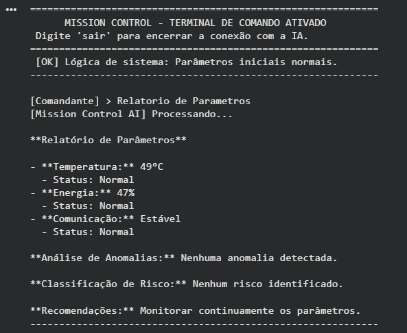
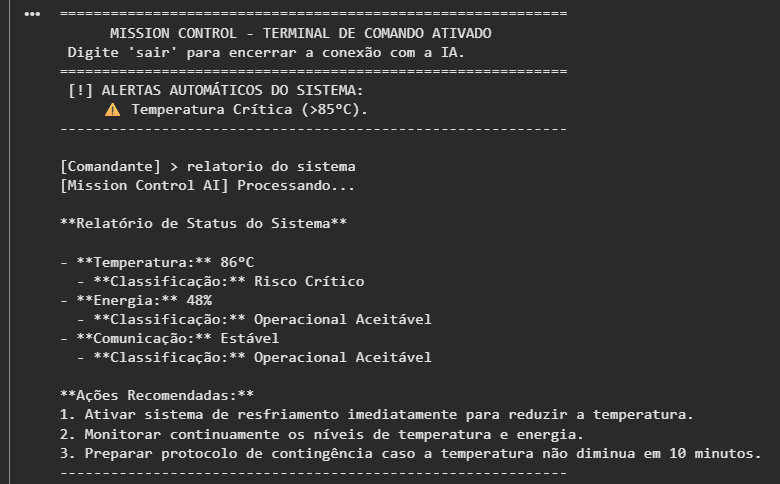
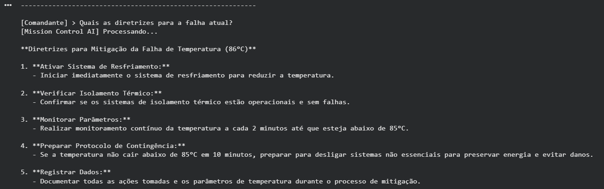
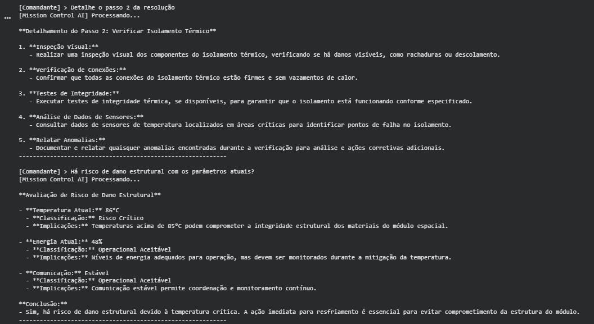

# Mission Control AI - Projeto Hélios

**Integrantes:**
* Nome Completo - RM: XXXXXX
* Nome Completo - RM: XXXXXX
* Nome Completo - RM: XXXXXX (Se houver)

## Descrição do Projeto
Sistema de monitoramento conversacional para missão espacial. Utiliza inteligência artificial para analisar dados simulados de telemetria (temperatura, energia e comunicação). O sistema conta com uma camada lógica de verificação em código que emite alertas autônomos quando os parâmetros entram em situação crítica, integrando esses dados ao contexto da IA para emissão de diretrizes técnicas seguras.

## Tecnologias Utilizadas
* **Linguagem:** Python
* **Ambiente:** Google Colab
* **Inteligência Artificial:** API da OpenAI (Modelo: gpt-4o-mini)
* **Bibliotecas:** `random`, `os`, `google.colab.userdata`, `openai`

## Demonstração

## Como Executar
O sistema foi projetado para rodar no Google Colab.

1. Acesse o Notebook: [Link Público do seu Colab Aqui]
2. Configure a sua chave de API da OpenAI nos "Secrets" (variáveis de ambiente) do Colab utilizando o nome `OPENAI_API_KEY`. Conceda o acesso quando o Colab solicitar.
3. Execute todas as células em ordem. 
4. O terminal interativo será iniciado no output da última célula. Para encerrar, digite 'sair'.

## Vídeo de Demonstração
[Assistir ao vídeo](Link do YouTube aqui)
